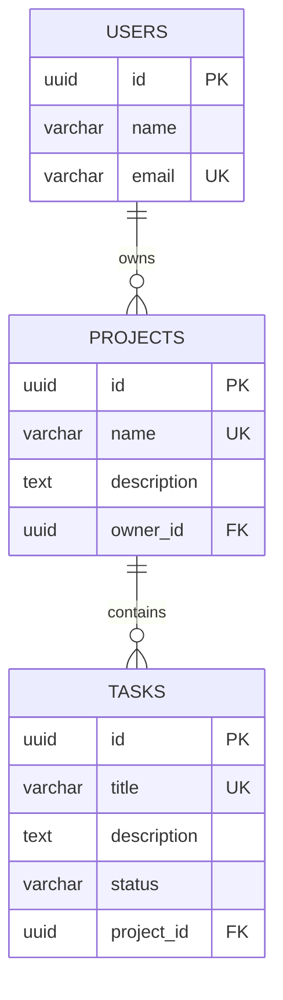

# 📋 TareasApp - Sistema de Gestión de Tareas

<div align="center">


**Sistema de gestión de proyectos y tareas con arquitectura hexagonal**

[Características](#-características) •
[Arquitectura](#-arquitectura) •
[Instalación](#-instalación) •
[API](#-endpoints-api) •
[Documentación](#-documentación)

</div>

---

## 📑 Tabla de Contenidos

- [Descripción](#-descripción)
- [Características](#-características)
- [Arquitectura Hexagonal](#-arquitectura-hexagonal)
- [Tecnologías](#-tecnologías)
- [Requisitos Previos](#-requisitos-previos)
- [Instalación](#-instalación)
- [Configuración](#-configuración)
- [Estructura del Proyecto](#-estructura-del-proyecto)
- [Endpoints API](#-endpoints-api)
- [Ejemplos de Uso](#-ejemplos-de-uso)
- [Base de Datos](#-base-de-datos)
- [Diagrama de Arquitectura](#-diagrama-de-arquitectura)
- [Contribuir](#-contribuir)

---

## 📝 Descripción

**TareasApp** es una aplicación de gestión de proyectos y tareas construida con **arquitectura hexagonal** (puertos y adaptadores). Permite a los usuarios crear proyectos, asignar tareas y gestionar el flujo de trabajo de manera eficiente.

### 🎯 ¿Por qué Arquitectura Hexagonal?

- ✅ **Independencia de frameworks**: El dominio no depende de Spring, JPA o cualquier tecnología externa
- ✅ **Testeable**: Puedes probar la lógica de negocio sin necesidad de infraestructura
- ✅ **Mantenible**: Cambios en la UI, BD o APIs no afectan el dominio
- ✅ **Escalable**: Fácil de extender con nuevos adaptadores (REST, GraphQL, CLI, etc.)

---

## ✨ Características

- 👥 **Gestión de Usuarios**: Crear y listar usuarios
- 📁 **Gestión de Proyectos**: Crear proyectos con propietarios
- ✅ **Gestión de Tareas**: Crear y gestionar tareas con estados
- 🔄 **Estados de Tareas**: PENDIENTE, EN_PROGRESO, COMPLETADA
- 🔗 **Relaciones**: Proyectos vinculados a usuarios, tareas vinculadas a proyectos
- 🛡️ **Validaciones**: Validación de datos con Bean Validation
- 🌐 **API REST**: Endpoints RESTful bien documentados
- 🗄️ **Persistencia**: PostgreSQL con Hibernate/JPA
- ☁️ **Base de datos en la nube**: Supabase (pooler IPv4)

---

## 🏗️ Arquitectura Hexagonal

```
┌─────────────────────────────────────────────────────────────┐
│                      DOMAIN (Núcleo)                        │
│                                                             │
│  ┌────────────┐  ┌─────────────┐  ┌───────────────┐      │
│  │   User     │  │   Project   │  │     Task      │      │
│  └────────────┘  └─────────────┘  └───────────────┘      │
│                                                             │
│  ┌─────────────────────────────────────────────────────┐  │
│  │              PORTS (Interfaces)                      │  │
│  │  ┌──────────────────┐  ┌────────────────────────┐  │  │
│  │  │  IN (UseCases)   │  │  OUT (Repositories)    │  │  │
│  │  ├──────────────────┤  ├────────────────────────┤  │  │
│  │  │ - CreateUser     │  │ - UserRepositoryPort   │  │  │
│  │  │ - CreateProject  │  │ - ProjectRepositoryPort│  │  │
│  │  │ - CreateTask     │  │ - TaskRepositoryPort   │  │  │
│  │  └──────────────────┘  └────────────────────────┘  │  │
│  └─────────────────────────────────────────────────────┘  │
└─────────────────────────────────────────────────────────────┘
                             ▲
                             │
        ┌────────────────────┴───────────────────────┐
        │                                            │
┌───────▼────────┐                          ┌────────▼────────┐
│  APPLICATION   │                          │ INFRASTRUCTURE  │
│                │                          │                 │
│  ┌──────────┐  │                          │  Adapters OUT:  │
│  │ Services │  │                          │  ┌────────────┐ │
│  ├──────────┤  │                          │  │ JPA Repos  │ │
│  │UserService│ │                          │  │ Entities   │ │
│  │ProjectSvc │  │                          │  │ Mappers    │ │
│  │ TaskSvc  │  │                          │  └────────────┘ │
│  └──────────┘  │                          │                 │
└────────────────┘                          │  Adapters IN:   │
                                            │  ┌────────────┐ │
                                            │  │Controllers │ │
                                            │  │   DTOs     │ │
                                            │  │ Exception  │ │
                                            │  │  Handlers  │ │
                                            │  └────────────┘ │
                                            └─────────────────┘
```

### 🎯 Principios SOLID Aplicados

- **S**ingle Responsibility: Cada capa tiene una responsabilidad única
- **O**pen/Closed: Abierto a extensión, cerrado a modificación
- **L**iskov Substitution: Los adaptadores son intercambiables
- **I**nterface Segregation: Puertos específicos y cohesivos
- **D**ependency Inversion: El dominio no depende de la infraestructura

---

## 🛠️ Tecnologías

| Tecnología | Versión | Propósito |
|-----------|---------|-----------|
| **Java** | 21 | Lenguaje de programación |
| **Spring Boot** | 4.0.1 | Framework principal |
| **Spring Data JPA** | 4.0.1 | Persistencia |
| **Hibernate** | 7.2.0 | ORM |
| **PostgreSQL** | 17.6 | Base de datos |
| **Supabase** | Cloud | Hosting de BD |
| **Maven** | 3.9+ | Gestión de dependencias |
| **Jakarta Validation** | 3.x | Validación de datos |

---

## 📋 Requisitos Previos

Antes de comenzar, asegúrate de tener instalado:

- ☕ **Java 21** ([Download](https://www.oracle.com/java/technologies/downloads/#java21))
- 📦 **Maven 3.9+** ([Download](https://maven.apache.org/download.cgi))
- 🐘 **PostgreSQL** (o cuenta en [Supabase](https://supabase.com))
- 🔧 **Git** ([Download](https://git-scm.com/))

### Verificar instalación:

```bash
java -version    # Debe mostrar Java 21
mvn -version     # Debe mostrar Maven 3.9+
```

---

## 🚀 Instalación

### 1️⃣ Clonar el repositorio

```bash
git clone https://github.com/tu-usuario/hexagonal-tareasapp.git
cd hexagonal-tareasapp
```

### 2️⃣ Configurar Base de Datos

#### Opción A: PostgreSQL Local

```sql
CREATE DATABASE tareasdb;
```

#### Opción B: Supabase (Recomendado)

1. Crea una cuenta en [Supabase](https://supabase.com)
2. Crea un nuevo proyecto
3. Ve a **Settings** → **Database** → **Connection Pooling**
4. Selecciona **Session mode** o **Transaction mode**
5. Copia las credenciales del pooler

### 3️⃣ Configurar aplicación

Edita `src/main/resources/application.properties`:

```properties
spring.application.name=tareasapp

# Database Configuration
spring.datasource.url=jdbc:postgresql://TU-HOST-AQUI:5432/postgres?sslmode=require
spring.datasource.username=TU-USUARIO
spring.datasource.password=TU-PASSWORD
spring.datasource.driver-class-name=org.postgresql.Driver

# JPA Configuration
spring.jpa.hibernate.ddl-auto=update
spring.jpa.show-sql=true
spring.jpa.properties.hibernate.format_sql=true

# Server Configuration
server.port=8080
```

### 4️⃣ Compilar y ejecutar

```bash
# Compilar
mvn clean install

# Ejecutar
mvn spring-boot:run
```

La aplicación estará disponible en: **http://localhost:8080**

---

## ⚙️ Configuración

### Variables de Entorno (Producción)

```bash
export DB_HOST=tu-host.supabase.co
export DB_PORT=5432
export DB_NAME=postgres
export DB_USER=postgres
export DB_PASSWORD=tu-password
export SERVER_PORT=8080
```

### Perfiles de Spring

```bash
# Desarrollo
mvn spring-boot:run -Dspring-boot.run.profiles=dev

# Producción
mvn spring-boot:run -Dspring-boot.run.profiles=prod
```

---

## 📁 Estructura del Proyecto

```
src/main/java/com/hexagonal/tareasapp/
│
├── 📦 domain/                          # CAPA DE DOMINIO
│   ├── model/                          # Entidades de dominio
│   │   ├── User.java                   # Usuario (con validaciones)
│   │   ├── Project.java                # Proyecto
│   │   └── Task.java                   # Tarea
│   ├── port/                           # Puertos (interfaces)
│   │   ├── in/                         # Puertos de entrada (Use Cases)
│   │   │   ├── UserUseCase.java
│   │   │   ├── ProjectUseCase.java
│   │   │   └── TaskUseCase.java
│   │   └── out/                        # Puertos de salida (Repositories)
│   │       ├── UserRepositoryPort.java
│   │       ├── ProjectRepositoryPort.java
│   │       └── TaskRepositoryPort.java
│   ├── enums/                          # Enumeraciones
│   │   └── Status.java                 # Estados de tareas
│   └── exception/                      # Excepciones de dominio
│       ├── UserNotFoundException.java
│       └── ProjectNotFoundException.java
│
├── 📱 application/                     # CAPA DE APLICACIÓN
│   └── service/                        # Servicios (Casos de uso)
│       ├── UserService.java
│       ├── ProjectService.java
│       └── TaskService.java
│
└── 🔌 infrastructure/                  # CAPA DE INFRAESTRUCTURA
    ├── in/                             # Adaptadores de ENTRADA
    │   ├── controller/                 # Controladores REST
    │   │   ├── UserController.java
    │   │   ├── ProjectController.java
    │   │   └── TaskController.java
    │   ├── dto/                        # DTOs de entrada
    │   │   ├── CreateUserRequest.java
    │   │   ├── CreateProjectRequest.java
    │   │   └── CreateTaskRequest.java
    │   └── exception/                  # Manejo global de errores
    │       └── GlobalExceptionHandler.java
    │
    ├── out/                            # Adaptadores de SALIDA
    │   ├── adapter/                    # Adaptadores JPA
    │   │   ├── UserJpaAdapter.java
    │   │   ├── ProjectJpaAdapter.java
    │   │   └── TaskJpaAdapter.java
    │   ├── entity/                     # Entidades JPA
    │   │   ├── UserJpaEntity.java
    │   │   ├── ProjectJpaEntity.java
    │   │   └── TaskJpaEntity.java
    │   └── repository/                 # Repositorios Spring Data
    │       ├── UserJpaRepository.java
    │       ├── ProjectJpaRepository.java
    │       └── TaskJpaRepository.java
    │
    ├── mapper/                         # Conversores entre capas
    │   ├── UserMapper.java
    │   ├── ProjectMapper.java
    │   └── TaskMapper.java
    │
    └── config/                         # Configuración
        └── BeanConfiguration.java
```

---

## 🌐 Endpoints API

### 👤 Usuarios

#### Crear Usuario
```http
POST /user/create
Content-Type: application/json

{
  "name": "Juan Pérez",
  "email": "juan.perez@example.com"
}
```

**Response 201 Created:**
```json
{
  "id": "550e8400-e29b-41d4-a716-446655440000",
  "name": "Juan Pérez",
  "email": "juan.perez@example.com"
}
```

#### Listar Usuarios
```http
GET /user/all
```

**Response 200 OK:**
```json
[
  {
    "id": "550e8400-e29b-41d4-a716-446655440000",
    "name": "Juan Pérez",
    "email": "juan.perez@example.com"
  }
]
```

---

### 📁 Proyectos

#### Crear Proyecto
```http
POST /project/create
Content-Type: application/json

{
  "name": "PanaEventos",
  "description": "Plataforma de gestión de eventos y venta de boletos",
  "ownerId": "550e8400-e29b-41d4-a716-446655440000"
}
```

**Response 201 Created:**
```json
{
  "id": "660e8400-e29b-41d4-a716-446655440001",
  "name": "PanaEventos",
  "description": "Plataforma de gestión de eventos y venta de boletos",
  "ownerId": "550e8400-e29b-41d4-a716-446655440000"
}
```

#### Listar Proyectos
```http
GET /project/all
```

---

### ✅ Tareas

#### Crear Tarea
```http
POST /task/create
Content-Type: application/json

{
  "title": "Implementar login",
  "description": "Crear sistema de autenticación con JWT",
  "projectId": "660e8400-e29b-41d4-a716-446655440001"
}
```

**Response 201 Created:**
```json
{
  "id": "770e8400-e29b-41d4-a716-446655440002",
  "title": "Implementar login",
  "description": "Crear sistema de autenticación con JWT",
  "status": "PENDIENTE",
  "projectId": "660e8400-e29b-41d4-a716-446655440001"
}
```

#### Listar Tareas
```http
GET /task/all
```

---

## 💡 Ejemplos de Uso

### Archivo de pruebas (`api-tests.http`)

```http
### Variables
@baseUrl = http://localhost:8080
@contentType = application/json

### 1. Crear Usuario
POST {{baseUrl}}/user/create
Content-Type: {{contentType}}

{
  "name": "María González",
  "email": "maria.gonzalez@example.com"
}

### 2. Listar Usuarios
GET {{baseUrl}}/user/all

### 3. Crear Proyecto
POST {{baseUrl}}/project/create
Content-Type: {{contentType}}

{
  "name": "Sistema de Inventario",
  "description": "Control de stock y productos",
  "ownerId": "TU-USER-ID-AQUI"
}

### 4. Crear Tarea
POST {{baseUrl}}/task/create
Content-Type: {{contentType}}

{
  "title": "Diseñar base de datos",
  "description": "Crear diagrama ER y tablas principales",
  "projectId": "TU-PROJECT-ID-AQUI"
}
```

---

## 🗄️ Base de Datos

### Diagrama ER



### Tablas

#### `users`
| Columna | Tipo | Restricciones |
|---------|------|---------------|
| id | UUID | PRIMARY KEY |
| name | VARCHAR(255) | NOT NULL |
| email | VARCHAR(255) | NOT NULL, UNIQUE |

#### `projects`
| Columna | Tipo | Restricciones |
|---------|------|---------------|
| id | UUID | PRIMARY KEY |
| name | VARCHAR(255) | NOT NULL, UNIQUE |
| description | TEXT | |
| owner_id | UUID | NOT NULL, FK → users(id) |

#### `tasks`
| Columna | Tipo | Restricciones |
|---------|------|---------------|
| id | UUID | PRIMARY KEY |
| title | VARCHAR(255) | NOT NULL, UNIQUE |
| description | TEXT | |
| status | VARCHAR(50) | NOT NULL |
| project_id | UUID | NOT NULL, FK → projects(id) |

---

## 🎨 Diagrama de Arquitectura

### Flujo de una Petición

```
┌──────────┐
│  Cliente │
└────┬─────┘
     │ HTTP POST /task/create
     │
     ▼
┌─────────────────────────────────────────┐
│      INFRASTRUCTURE (IN)                │
│                                         │
│  ┌───────────────────────────────────┐ │
│  │  TaskController                   │ │
│  │  - Recibe CreateTaskRequest DTO   │ │
│  │  - Valida con @Valid              │ │
│  └────────────┬──────────────────────┘ │
└───────────────┼─────────────────────────┘
                │ taskUseCase.create(...)
                ▼
┌─────────────────────────────────────────┐
│        APPLICATION                      │
│                                         │
│  ┌───────────────────────────────────┐ │
│  │  TaskService                      │ │
│  │  - Valida que el proyecto existe │ │
│  │  - Crea Task (domain)             │ │
│  │  - Guarda con repositorio         │ │
│  └────────────┬──────────────────────┘ │
└───────────────┼─────────────────────────┘
                │ taskRepo.save(task)
                ▼
┌─────────────────────────────────────────┐
│      INFRASTRUCTURE (OUT)               │
│                                         │
│  ┌───────────────────────────────────┐ │
│  │  TaskJpaAdapter                   │ │
│  │  - Convierte Task → Entity (JPA)  │ │
│  │  - Guarda en BD                   │ │
│  │  - Convierte Entity → Task        │ │
│  └────────────┬──────────────────────┘ │
└───────────────┼─────────────────────────┘
                │ repository.save(entity)
                ▼
           ┌──────────┐
           │ Database │
           │PostgreSQL│
           └──────────┘
```

---

## 🧪 Testing

### Ejecutar Tests

```bash
# Todos los tests
mvn test

# Tests específicos
mvn test -Dtest=UserServiceTest
mvn test -Dtest=ProjectServiceTest
```

### Cobertura

```bash
mvn jacoco:report
```

---

## 🤝 Contribuir

¡Las contribuciones son bienvenidas! Por favor sigue estos pasos:

1. Fork el proyecto
2. Crea una rama para tu feature (`git checkout -b feature/AmazingFeature`)
3. Commit tus cambios (`git commit -m 'Add: Amazing Feature'`)
4. Push a la rama (`git push origin feature/AmazingFeature`)
5. Abre un Pull Request

### Convención de Commits

- `Add:` Nueva funcionalidad
- `Fix:` Corrección de bugs
- `Update:` Actualización de código existente
- `Refactor:` Refactorización sin cambio de funcionalidad
- `Docs:` Cambios en documentación

---

## 📄 Licencia

Este proyecto está bajo la Licencia MIT - ver el archivo [LICENSE](LICENSE) para más detalles.

---

## 👨‍💻 Autor

**Tu Nombre**
- GitHub: [@waxXaa](https://github.com/WaxXaa)
- LinkedIn: [AlejandroJesús](https://linkedin.com/in/mfalejesus/)


<div align="center">

**⭐ Si este proyecto te fue útil, considera darle una estrella ⭐**

Hecho con ❤️ usando Arquitectura Hexagonal

</div>
